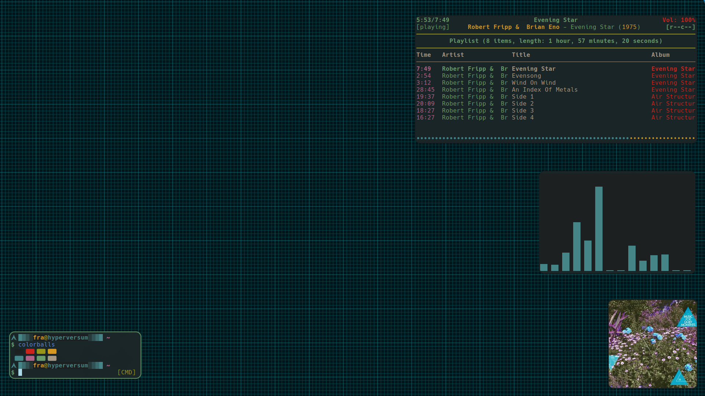
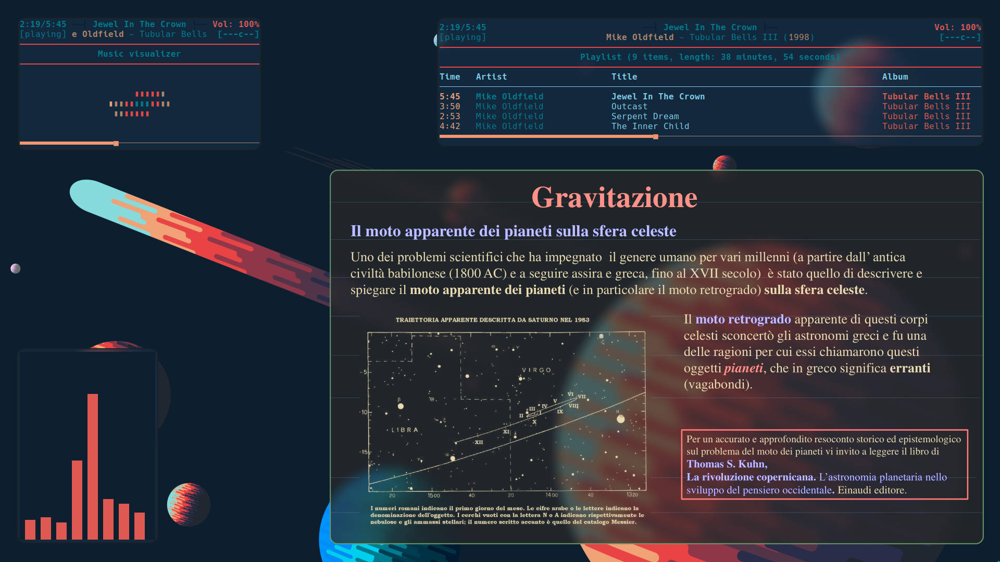
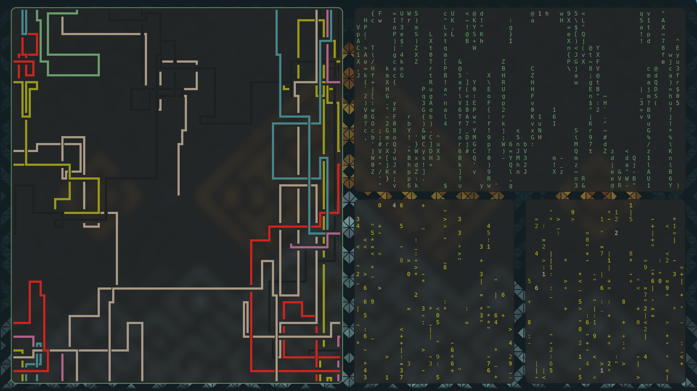
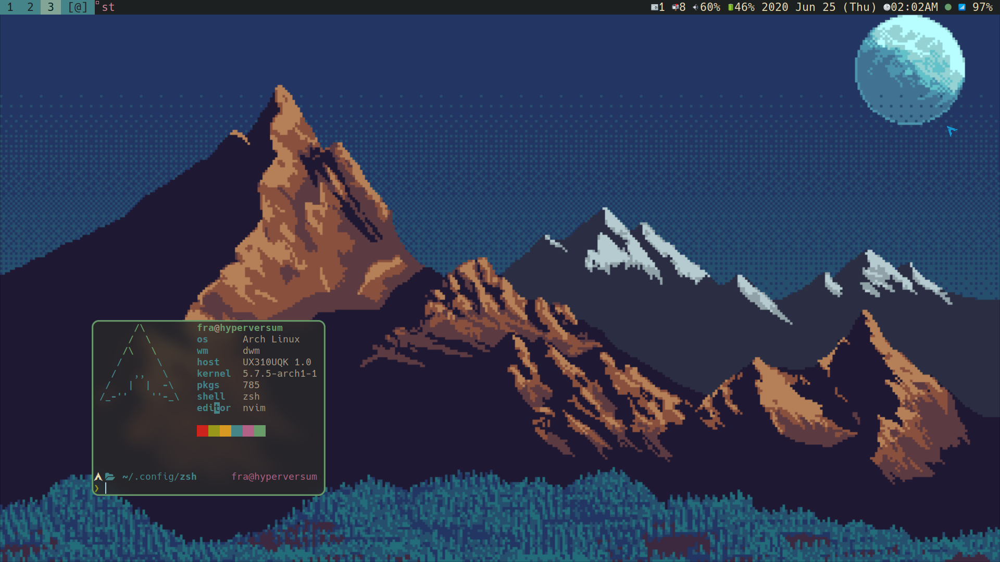
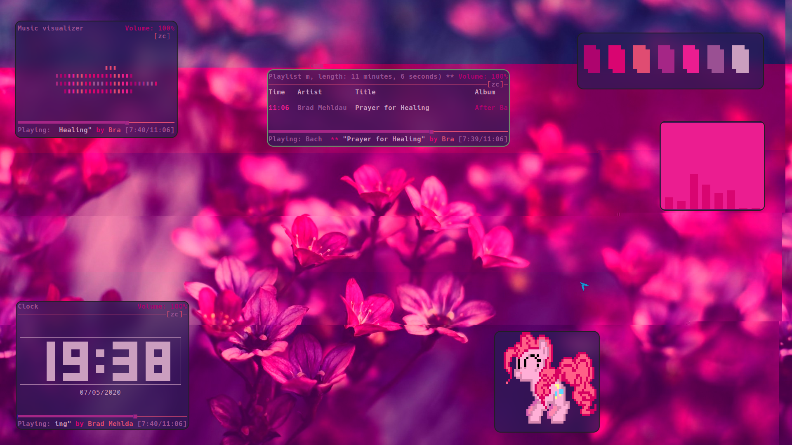
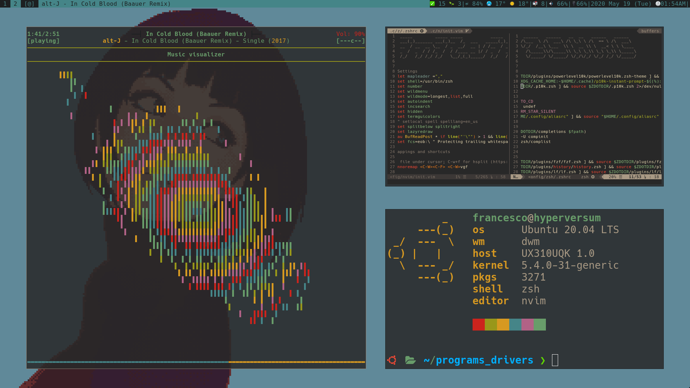
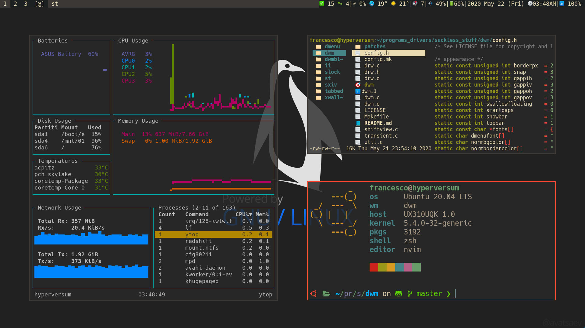
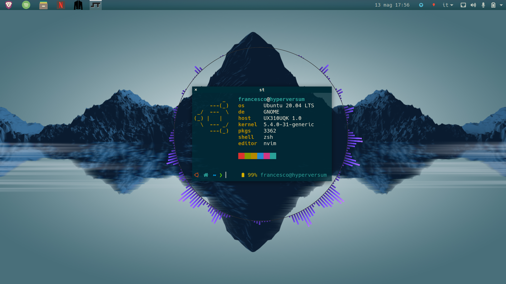

``` sh
██████╗  ██████╗ ████████╗███████╗██╗██╗     ███████╗███████╗
██╔══██╗██╔═══██╗╚══██╔══╝██╔════╝██║██║     ██╔════╝██╔════╝
██║  ██║██║   ██║   ██║   █████╗  ██║██║     █████╗  ███████╗
██║  ██║██║   ██║   ██║   ██╔══╝  ██║██║     ██╔══╝  ╚════██║
██████╔╝╚██████╔╝   ██║   ██║     ██║███████╗███████╗███████║
╚═════╝  ╚═════╝    ╚═╝   ╚═╝     ╚═╝╚══════╝╚══════╝╚══════╝
```
This are my dotfiles set up as a bare git repo and managed with [dotbare](https://github.com/kazhala/dotbare)
<!-- vim-markdown-toc GFM -->

* [Current Setup](#current-setup)
	* [Eye-candy](#eye-candy)
	* [Various](#various)
	* [Screens](#screens)
		* [Dwm](#dwm)
		* [Gnome-Shell](#gnome-shell)

<!-- vim-markdown-toc -->
# Current Setup

My setup is pretty minimal and fast: although many packages and systemd services are launched at boot, rebooting from dwm to dwm takes approximately 15 seconds(with grub).
I run Arch Linux on an Asus UX310UQK laptop; here are some of the programs I use:

- Suckless utilities (links are to my patched repos): **[dmenu](https://github.com/BachoSeven/dmenu)**, **[dwm](https://github.com/BachoSeven/dwm)** (Window Manager), **[st](https://github.com/BachoSeven/st)** (terminal emulator) and **[xss](https://github.com/9wm/xss)+[slock](https://github.com/BachoSeven/slock)** (screensaver).
- Minimally configured **zsh**  shell with custom plugins, completions and [prompt](https://imgur.com/a/KwMIxDg) (old p10k [themes](https://github.com/BachoSeven/dotfiles/tree/master/.config/zsh/plugins/p10k_theme)). For syntax highlighting, I use **[fsh](https://github.com/zdharma/fast-syntax-highlighting)**; startup time is `34 ms`.


- **neovim** text editor
- **[stig](https://github.com/rndusr/stig)** to interact with the transmission-daemon client
- **ncmpcpp** as a music player (with mpd)
- **[ncspot](https://github.com/hrkfdn/ncspot)** as a tui spotify client
- **[lf](https://github.com/gokcehan/lf)** as my file manager
- **neomutt** as an email client
- **ungoogled-chromium** browser
- **[sxiv](https://github.com/muennich/sxiv)** image viewer
- **zathura** pdf & djvu reader
- **[ytop](https://github.com/cjbassi/ytop)** system monitoring
- **copyq** is the clipboard manager
- **dunst** is the notification manager
- Last but not least, **[mimi](https://github.com/BachoSeven/mimi)** is an __improved xdg-open__ using bash and dmenu with a very usable config file.

## Eye-candy

- I set `gruvbox` colors in Xresources, zathura, ncspot, dircolors, dunst, neovim, copyq, all suckless config and anywhere else (although I tried to keep a commented solarized alternative where I could for nostalgia).
- I also use `pywal` now and then, you will find various attempts at integrating it with other programs across this repo
- The compositor is `picom` ([picom-ibhagwan-git](https://aur.archlinux.org/packages/picom-ibhagwan-git/) fork)
- Icons are Joypixels ([ttf-joypixels](https://www.archlinux.org/packages/community/any/ttf-joypixels/))
- The default gtk 2/3 theme is [Gruvbox-Dark](https://github.com/jmattheis/gruvbox-dark-gtk)
- My font is `Hack Nerd Font`

## Various

- I use ungoogled-chromium, you can find info about my config of it at `.config/brave_plugins`. To improve its aesthetics, I use a gruvbox chrome theme and duckduckgo with `gruvboxytheme` pass phrase; which make a decent start page together Vimium's Vomnibar. (I now use a custom start page with Brave, check it out [here](https://github.com/BachoSeven/startpage).
- I use vim bindings, when possible.
- [pacgraph](http://github.com/keenerd/pacgraph/) output:<br>


## Screens

### Dwm
















### Gnome-Shell



