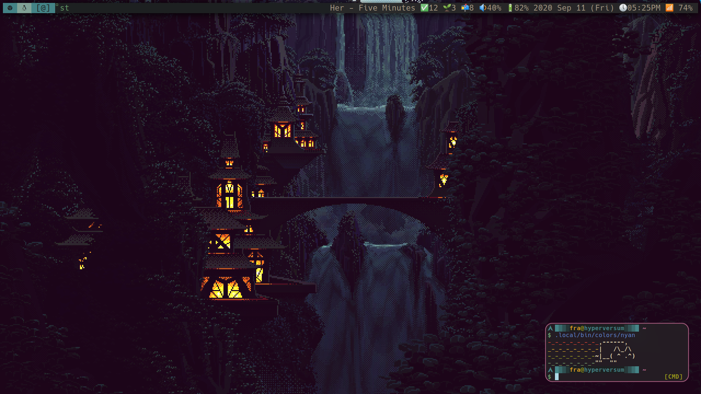
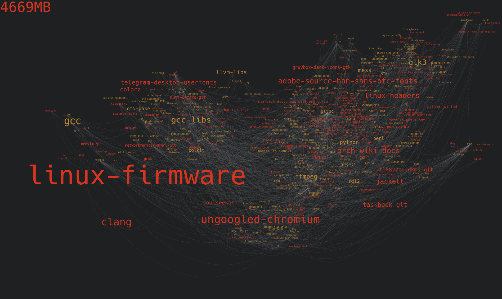
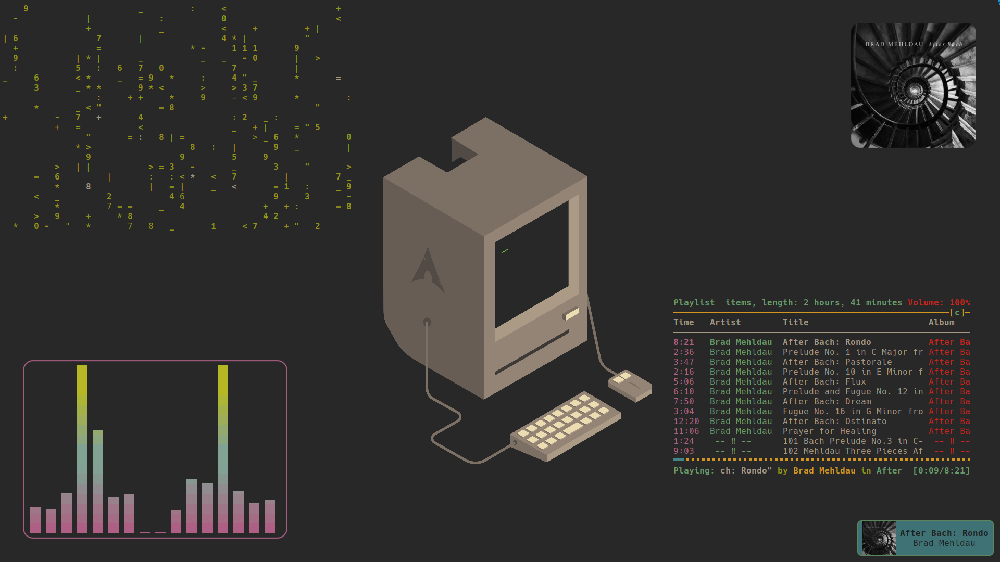
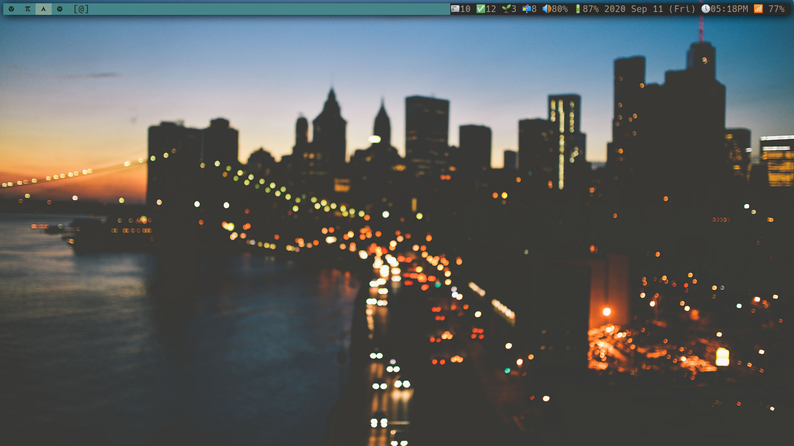

<a href="https://www.archlinux.org/"></a>

``` sh
██████╗  ██████╗ ████████╗███████╗██╗██╗     ███████╗███████╗
██╔══██╗██╔═══██╗╚══██╔══╝██╔════╝██║██║     ██╔════╝██╔════╝
██║  ██║██║   ██║   ██║   █████╗  ██║██║     █████╗  ███████╗
██║  ██║██║   ██║   ██║   ██╔══╝  ██║██║     ██╔══╝  ╚════██║
██████╔╝╚██████╔╝   ██║   ██║     ██║███████╗███████╗███████║
╚═════╝  ╚═════╝    ╚═╝   ╚═╝     ╚═╝╚══════╝╚══════╝╚══════╝
```
This are my dotfiles set up as a bare git repo and managed with [dotbare](https://github.com/kazhala/dotbare)
<!-- vim-markdown-toc GEM -->

* [Current Setup](#current-setup)
    * [Eye-candy](#eye-candy)
    * [Various](#various)
    * [Screens](#screens)
        * [Dwm](#dwm)
            * [Blue(s)](#blues)
            * [Greenish](#greenish)
            * [Pink :3](#pink-3)
            * [Gruvboxy](#gruvboxy)
        * [Gnome-Shell (Ubuntu)](#gnome-shell-ubuntu)
        * [Lama](#lama)

<!-- vim-markdown-toc -->
# Current Setup
My setup is pretty minimal; I run Arch Linux on an Asus UX310UQK laptop.
Here are some of the programs I use:

- Suckless utilities (links are to my patched repositories): **[dmenu](https://github.com/BachoSeven/dmenu)**, **[dwm](https://github.com/BachoSeven/dwm)** (Window Manager), **[st](https://github.com/BachoSeven/st)** (terminal emulator) and **[xss](https://github.com/9wm/xss)+[slock](https://github.com/BachoSeven/slock)** (screensaver).
- Minimally configured **zsh**  shell with custom plugins, completions and prompt (old p10k themes [here](https://github.com/BachoSeven/dotfiles/tree/master/.config/zsh/plugins/p10k_theme)). For syntax highlighting, I use **[fsh](https://github.com/zdharma/fast-syntax-highlighting)**; startup time is `34 ms`.


- **[neovim](.config/nvim)** text editor
- **[stig](https://github.com/rndusr/stig)** to interact with the transmission-daemon client
- **[ncmpcpp](.config/ncmpcpp)** as a music player (with mpd)
- **[ncspot](https://github.com/hrkfdn/ncspot)** as a tui spotify client
- **[lf](https://github.com/gokcehan/lf)** as my file manager
- **[neomutt](.config/mutt)** as an email client
- **ungoogled-chromium** browser
- **[sxiv](https://github.com/muennich/sxiv)** image viewer
- **[zathura](.config/zathura/zathurarc)** pdf & djvu reader
- **[ytop](https://github.com/cjbassi/ytop)** system monitoring
- **copyq** is the clipboard manager
- **[dunst](.config/dunst/dunstrc)** is the notification manager
- **[cava](.config/cava/config)** is the music visualizer
- **[redshift](.config/redshift/redshift.conf)** sets the color temperature
- **[newsboat](.config/newsboat)** is my RSS reader
- **[yay](.config/yay/config.json)** is the AUR helper
- Last but not least, **[mimi](https://github.com/BachoSeven/mimi)** is an __improved xdg-open__ using bash and dmenu with a very usable config file.

Read more about the programs I use in the **[AARGH](https://github.com/BachoSeven/AARGH) repository (bootstrapping script).**

## Eye-candy

- I set `gruvbox` colors in Xresources, zathura, ncspot, dircolors, dunst, neovim, copyq, all suckless config and anywhere else (although I tried to keep a commented solarized alternative where I could for nostalgia). I even set them in the **[tty](https://www.reddit.com/r/unixporn/comments/igdhic/etcissue_material_gruvbox_virtual_console_login/)**.
- I also use `pywal` now and then, you will find various attempts at integrating it with other programs across this repo
- The compositor is `picom` ([picom-ibhagwan-git](https://aur.archlinux.org/packages/picom-ibhagwan-git/) fork)
- Icons are Joypixels ([ttf-joypixels](https://www.archlinux.org/packages/community/any/ttf-joypixels/))
- The default gtk 2/3 theme is [Gruvbox-Dark](https://github.com/jmattheis/gruvbox-dark-gtk)
- My font is `Hack Nerd Font`

## Various

- I like using vim bindings whenever possible.
- I use ungoogled-chromium, find my setup in [here](.config/browser). To improve its aesthetics, I use the Gtk  theme and duckduckgo with `gruvboxytheme` pass phrase. I use a custom startpage, check it out [here](https://github.com/BachoSeven/startpage)!
- [Pacgraph](http://github.com/keenerd/pacgraph/) output:


## Screens

### Dwm

#### Gruvboxy



#### Blue(s)



#### Greenish


#### Pink :3


### Gnome-Shell (Ubuntu)


### Lama
here be lamas
```
                                 ████  ████
                               ▓▓▒▒▓▓▓▓▒▒▓▓▓▓
                               ██▒▒▒▒██▒▒▒▒██
                                 ██▒▒▒▒▒▒██
                                 ████▒▒████
                                 ██▒▒██░░██
                                 ██▒▒▒▒▒▒██
                                 ██░░▒▒░░██
                                 ██▒▒░░░░██
                         ▓▓████████▒▒░░░░██
                         ██████████▒▒░░░░██
                       ██▒▒▒▒▒▒  ██░░░░░░  ██
                     ██▓▓▓▓▓▓░░▓▓░░  ░░░░  ██
                     ██▒▒▓▓▓▓░░██░░  ░░░░  ██
                     ██▓▓▓▓▒▒▒▒░░░░░░░░    ██
                       ██▓▓▒▒░░░░░░░░░░  ██
                       ▓▓▓▓▒▒▒▒░░░░▒▒░░  ██
                         ██▓▓██████████████
                         ██░░██░░██  ██░░██
                         ██  ██  ██  ██  ██
                           ████████  ██████
```

```
           ▓▓  ▓▓
         ▓▓░░▓▓░░▓▓
       ▓▓▓▓░░░░░░▓▓
     ▓▓░░░░░░██░░▓▓
     ▓▓░░░░░░░░░░▓▓
       ▓▓▓▓░░░░░░▓▓
           ▓▓░░░░▓▓
           ▓▓░░░░▓▓                ▓▓
           ▓▓░░░░▓▓              ▓▓░░▓▓
           ▓▓░░░░▓▓              ▓▓░░▓▓
           ▓▓░░░░░░▓▓▓▓▓▓▓▓▓▓▓▓▓▓░░░░▓▓
           ▓▓░░░░░░░░░░░░░░░░░░░░░░▓▓
           ▓▓░░░░░░░░░░░░░░░░░░░░░░▓▓
           ▒▒░░░░░░░░░░░░░░░░░░░░░░▒▒
           ▓▓░░░░░░░░░░░░░░░░░░░░░░▓▓
             ▓▓░░░░░░░░░░░░░░░░░░▓▓
             ▓▓▒▒▒▒░░▓▓▓▓▒▒▒▒▒▒░░▓▓
             ▓▓░░▓▓░░▓▓  ▓▓░░▓▓░░▓▓
             ▓▓░░▓▓░░▓▓  ▓▓░░▓▓░░▓▓
             ▓▓░░▓▓░░▓▓  ▓▓░░▓▓░░▓▓
             ▓▓░░▓▓░░▓▓  ▓▓░░▓▓░░▓▓
             ▓▓░░▒▒░░▒▒  ▒▒░░▓▓░░▓▓
             ░░▒▒  ▒▒░░    ▒▒░░▒▒
```
